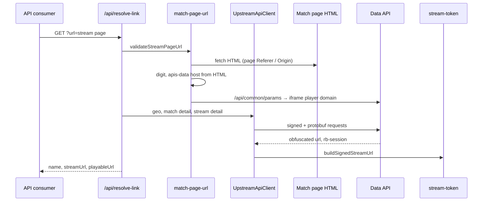
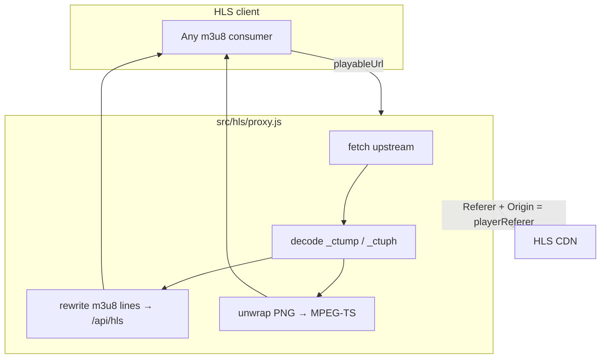

# FCTV33 Stream Resolver

**Self-hosted HLS stream resolver and m3u8 proxy.** Paste a live sports match page URL, resolve it to a tokenized CDN playlist through a local REST API, and copy a direct proxied stream link for VLC, Stremio, mpv, or any HLS client — zero npm runtime dependencies.

[](https://nodejs.org/)
[](#disclaimer)
[](#stack)

## Table of contents

- [Quick start](#quick-start)
- [What problem does this solve?](#what-problem-does-this-solve)
- [Features](#features)
- [Use cases](#use-cases)
- [How does stream resolution work?](#how-does-stream-resolution-work)
- [How does HLS playback work?](#how-does-hls-playback-work)
- [REST API reference](#rest-api-reference)
- [Stack](#stack)
- [Source layout](#source-layout)
- [FAQ](#faq)
- [Disclaimer](#disclaimer)

## Quick start

Requires Node.js 18+ (native `fetch` and ES modules).

```bash
git clone https://github.com/sharoon7171/fctv33-stream-resolver.git
cd fctv33-stream-resolver
npm start
```

Open `http://localhost:8787`, paste a match stream page URL, and click **Resolve**. The built-in player loads the proxied HLS stream automatically.

Resolve via API:

```bash
curl "http://localhost:8787/api/resolve-link?url=https://example.com/basketball/lakers-vs-celtics-2187976/live.html"
```

```json
{
  "name": "Lakers vs Celtics",
  "streamUrl": "https://cdn.example.com/token-…/index.m3u8",
  "playableUrl": "http://localhost:8787/api/hls?url=…&referer=…"
}
```

Use `playableUrl` — a direct stream link you can open in VLC, Stremio, mpv, Kodi, or any other HLS client. Set `PORT` to override the default `8787`.

## What problem does this solve?

A live sports **match page URL is not the stream**. The page is a shell — layout, metadata, and links to a hidden data API. The actual **m3u8 playlist URL** is obfuscated, session-bound, and only accessible with the correct `Referer` and `Origin` headers from the iframe player domain.

This project reverse-engineers that chain end to end:

1. Scrapes runtime config from match page HTML (API host, site digit, player referer).
2. Calls the upstream data API with signed protobuf requests.
3. Decodes ROT47 obfuscation and builds an AES-256-CBC tokenized m3u8 URL.
4. Proxies all HLS traffic through `/api/hls` so playback works without manual header injection.

Nothing is hardcoded per site — API hosts, player referers, and request signatures are discovered at runtime from page HTML and upstream responses.

## Features

| Capability | Detail |
| --- | --- |
| Match page parsing | Extracts `matchId`, `sportType`, site digit, and data API host from any supported FCTV33 match URL |
| Signed API chain | MD5-prefixed path signing, protobuf envelope parsing, geo-aware stream detail |
| Token URL builder | ROT47 decode → AES-256-CBC session token → tokenized CDN m3u8 path |
| HLS proxy | Rewrites m3u8 manifests, decodes `_ctump` / `_ctuph` segment URLs, unwraps PNG-wrapped MPEG-TS |
| Referer injection | Applies iframe player `Referer` and `Origin` on every upstream CDN fetch |
| Browser UI | Built-in web player with hls.js, resolve timing, and exportable direct/proxied URLs |
| Zero runtime deps | Node.js built-ins only — `node:http`, `node:crypto`, native `fetch` |

Supported sports include football, basketball, tennis, baseball, cricket, hockey, rugby, motorsport, and more. See [`src/config/site.js`](src/config/site.js) for the full sport slug map.

## Use cases

| Scenario | Description |
| --- | --- |
| Web UI playback | Submit a match page URL at `/`; the resolver returns stream metadata and starts live playback through the built-in player. |
| External playback | Copy `playableUrl` (Browser URL) and open it as a direct stream link in any HLS client — see [The proxied link](#the-proxied-link-is-a-direct-stream-url). |
| API integration | Call `GET /api/resolve-link?url=` from scripts, services, or automation. Feed `playableUrl` to downstream consumers without handling CDN referer headers. |
| Custom front-end | Replace the default UI while keeping the two-endpoint contract. See [`public/app.js`](public/app.js) for hls.js wiring against `playableUrl`. |
| Deep-link resolve | Pass `?url=` on the web UI root to resolve a match page on load without manual input. |
| Upstream protocol study | Trace the full resolve path in source: HTML scrape, signed API bootstrap, protobuf parsing, AES token URL construction, and HLS manifest rewrite. |

Deep-link example:

```
GET http://localhost:8787/?url=https://example.com/football/match-1234567/live.html
```

## How does stream resolution work?

`GET /api/resolve-link?url=` is handled by [`src/resolve/stream.js`](src/resolve/stream.js). The handler validates the URL, walks the upstream chain, and returns a stream name, raw m3u8 URL, and proxied playback URL.



### What URL format is accepted?

Input must be an individual match page:

```
https://{any-host}/{optional-locale}/{sport}/{slug}-{matchId}.html
```

[`src/upstream/match-page-url.js`](src/upstream/match-page-url.js) maps the sport slug to `sportType` and reads `matchId` from the slug suffix. An optional locale prefix (`en`, `zh`, `th`, etc.) is skipped. Query param `mdata` can supply base64-encoded `matchId_sportType` instead.

The page is fetched with `Referer` and `Origin` set to the stream page origin. From the HTML, two values are extracted: the data API host (`apis-data\d+\.[a-z0-9.-]+`) and the stream site digit (`layout:"livestream-{digit}"`).

### What referer contexts are used?

Two referer values are used downstream:

| Context | Source | Used for |
| --- | --- | --- |
| Page | Stream page URL origin | Match page fetch, geo, signature bootstrap, match detail |
| Player | `iframePlayerDomains[digit]` from `common:web:client` | Stream detail, CDN access via `/api/hls` |

Player domain comes from `GET {apiBase}/api/common/params` (ROT47-encoded JSON). If no iframe domain exists for the digit, resolution fails.

### What is the upstream API chain?

[`src/upstream/api-client.js`](src/upstream/api-client.js) calls the data API in order:

| Step | Endpoint | Output |
| --- | --- | --- |
| Geo | `/api/user/info` | `country`, `continent` |
| Signatures | `/api/common/bs` | Body-signing keys (cached per match) |
| Match | `/sfver{md5prefix}{suffix}/api/match/detail` | Streams with `streamId`, `siteType`, `name` |
| Stream | `/api/stream/detail` | Obfuscated `url`; `rb-session` response header |

Match detail is signed: params sorted per `REQUEST_PARAM_ORDER`, six-character MD5 path prefix ([`src/crypto/request-hash.js`](src/crypto/request-hash.js)), suffix from bootstrap key `0x66`. Protobuf bodies are parsed in [`src/upstream/protobuf.js`](src/upstream/protobuf.js). The handler picks the first stream with a `streamId`.

### How is the tokenized m3u8 URL built?

[`src/crypto/stream-token.js`](src/crypto/stream-token.js) builds the CDN m3u8:

1. ROT47-decode the obfuscated URL (drop first eight characters).
2. AES-256-CBC encrypt the `rb-session` token.
3. Insert `token-{encryptedBase64}a` into the path.

The response contains `streamUrl` (raw upstream m3u8) and `playableUrl` (`/api/hls` with `referer` set to the player domain).

## How does HLS playback work?

CDN m3u8 and segment requests require the iframe player as `Referer` and `Origin`. A client cannot fetch them directly from the raw `streamUrl`. `playableUrl` routes all HLS traffic through [`src/hls/proxy.js`](src/hls/proxy.js), which applies the player referer on every upstream fetch and returns a plain HTTP HLS endpoint.

### The proxied link is a direct stream URL

`playableUrl` (shown as **Browser URL** in the web UI) is a ready-to-play stream link — not a page URL and not a embed. Copy it after resolve and paste it into any app that accepts an m3u8 URL. No extra setup per player; the proxy handles referer headers and manifest rewrite upstream.

Works with VLC, Stremio, mpv, Kodi, PotPlayer, IINA, ffplay, IPTV apps (TiviMate, IPTV Smarters), OBS, Safari, mobile players, Smart TV apps, and any other HLS client or competitor that opens network stream URLs.

The resolver must be reachable from the device running the player: use `localhost` on the same host, or substitute the host's LAN IP when playing from another machine on the network. `/api/hls` responses include CORS headers for cross-origin browser access.



### What does the HLS proxy do on each request?

Each `GET /api/hls?url=&referer=` request:

1. Fetches upstream with CDN headers derived from `referer`.
2. Decodes `_ctump` / `_ctuph` segment URLs when present ([`src/crypto/segment-url.js`](src/crypto/segment-url.js)).
3. Rewrites `#EXTM3U` media lines to `/api/hls` so the consumer never leaves the resolver origin.
4. Unwraps PNG-contained MPEG-TS and returns `video/mp2t` when the sync byte is `0x47`.

Upstream HTML or non-2xx responses return `502`.

The reference client ([`public/app.js`](public/app.js)) consumes `playableUrl` via hls.js or native HLS and does not set CDN headers. Live playback uses a 3-segment sync window with 6-segment max latency.

## REST API reference

| Route | Params | Response |
| --- | --- | --- |
| `GET /api/resolve-link` | `url` — match stream page URL | `{ name, streamUrl, playableUrl }` or `{ error }` |
| `GET /api/hls` | `url` — upstream m3u8 or segment URL; `referer` — iframe player referer | Rewritten m3u8 text or MPEG-TS bytes |

### `GET /api/resolve-link`

Resolves a match stream page URL to a playable HLS link.

| Param | Required | Description |
| --- | --- | --- |
| `url` | yes | Full match page URL from the browser address bar |

**Success (200):**

```json
{
  "name": "Team A vs Team B",
  "streamUrl": "https://cdn…/token-…/index.m3u8",
  "playableUrl": "http://localhost:8787/api/hls?url=…&referer=…"
}
```

**Errors:** `400` for invalid or missing URL; `502` when upstream resolution fails.

### `GET /api/hls`

HLS proxy endpoint for m3u8 manifests and MPEG-TS segments.

| Param | Required | Description |
| --- | --- | --- |
| `url` | yes | Upstream m3u8 or segment URL |
| `referer` | yes | Stream iframe referer for CDN access |

Returns rewritten m3u8 (`application/vnd.apple.mpegurl`) or MPEG-TS (`video/mp2t`). Includes CORS headers for browser playback.

## Stack

| Layer | Component | Role |
| --- | --- | --- |
| Runtime | Node.js (ES modules) | Resolve pipeline and HTTP server |
| HTTP | `node:http` | TCP listener; requests adapted to the Web `Request` API |
| Networking | native `fetch` | Match page, data API, and CDN fetches |
| Cryptography | `node:crypto` | MD5 request-hash prefix; AES-256-CBC stream token |
| Serialization | Hand-rolled protobuf | API envelope and field parsing |
| Playback | hls.js (CDN) | MSE HLS demux in the reference client |

## Source layout

```
src/
  main.js                 HTTP server entry
  http/router.js          Route dispatch
  resolve/stream.js       /api/resolve-link handler
  hls/proxy.js            /api/hls proxy and manifest rewrite
  upstream/api-client.js  Signed data API client
  upstream/match-page-url.js  URL validation and page scrape
  upstream/protobuf.js    Protobuf envelope parsing
  crypto/rot47.js         ROT47 decode
  crypto/request-hash.js  MD5 path prefix signing
  crypto/stream-token.js  AES token URL builder
  crypto/segment-url.js   _ctump / _ctuph segment decode
  config/site.js          Sport slugs, locale codes, API constants
public/
  index.html              Web UI
  style.css               UI styles
  app.js                  hls.js reference player
```

## FAQ

<details>
<summary>What is the difference between streamUrl and playableUrl?</summary>

`streamUrl` is the raw upstream tokenized m3u8 on the CDN — it needs iframe referer headers and is not a direct playback link. `playableUrl` is the proxied direct stream URL with headers handled by `/api/hls`. Always copy `playableUrl` for VLC, Stremio, mpv, or any other player.
</details>

<details>
<summary>Does this work when the FCTV33 domain changes?</summary>

Yes. API hosts and player referers are scraped from match page HTML at runtime — no hardcoded domain list is required. Sport slugs and locale codes are configured in [`src/config/site.js`](src/config/site.js).
</details>

<details>
<summary>Why zero npm dependencies?</summary>

The entire resolve and proxy pipeline uses Node.js built-ins. hls.js is loaded from CDN in the browser UI only — it is not a server runtime dependency.
</details>

<details>
<summary>What sports are supported?</summary>

Any sport with a slug in `SPORT_SLUGS`: football, basketball, tennis, baseball, cricket, motorsport, rugby, american-football, aussie-rules, hockey, badminton, volleyball, fighting, cycling, handball, and others.
</details>

## Disclaimer

This project documents and demonstrates third-party streaming mechanics for educational and research purposes only. It is not affiliated with any broadcaster or rights holder. You are responsible for complying with applicable law and terms of service where you use it. Do not use this tool to circumvent access controls or distribute copyrighted content without authorization.
