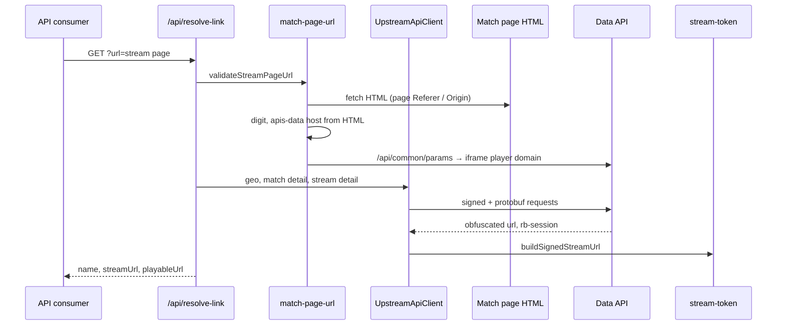
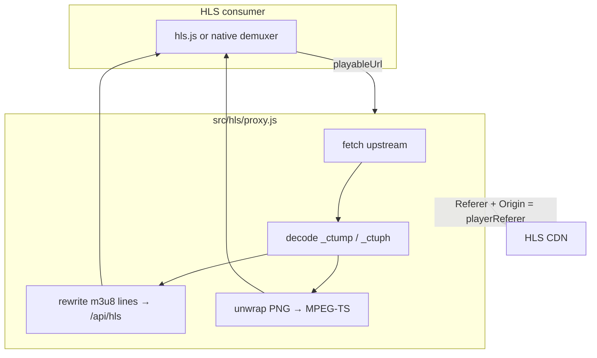

# fctv33-stream-resolver

HLS stream resolver that maps a match stream page URL to a tokenized m3u8 on the CDN. All runtime configuration — API hosts, player referers, request signatures — is discovered from page HTML and upstream responses; nothing is hardcoded per site. Zero npm runtime dependencies.

## How resolution works

`GET /api/resolve-link?url=` is handled by `src/resolve/stream.js`. The handler validates the URL, walks the upstream chain, and returns a stream name, raw m3u8 URL, and proxied playback URL.



### URL and page scrape

Input must be an individual match page:

```
https://{any-host}/{optional-locale}/{sport}/{slug}-{matchId}.html
```

`src/upstream/match-page-url.js` maps the sport slug to `sportType` and reads `matchId` from the slug suffix. An optional locale prefix is skipped; sport slugs and locale codes are listed in `src/config/site.js`. Query param `mdata` can supply base64-encoded `matchId_sportType` instead.

The page is fetched with `Referer` and `Origin` set to the stream page origin. From the HTML, two values are extracted: the data API host (`apis-data\d+\.[a-z0-9.-]+`) and the stream site digit (`layout:"livestream-{digit}"`).

### Referer contexts

Two referer values are used downstream:

| Context | Source | Used for |
| --- | --- | --- |
| Page | Stream page URL origin | Match page fetch, geo, signature bootstrap, match detail |
| Player | `iframePlayerDomains[digit]` from `common:web:client` | Stream detail, CDN access via `/api/hls` |

Player domain comes from `GET {apiBase}/api/common/params` (ROT47-encoded JSON). If no iframe domain exists for the digit, resolution fails.

### Upstream API chain

`src/upstream/api-client.js` calls the data API in order:

| Step | Endpoint | Output |
| --- | --- | --- |
| Geo | `/api/user/info` | `country`, `continent` |
| Signatures | `/api/common/bs` | Body-signing keys (cached per match) |
| Match | `/sfver{md5prefix}{suffix}/api/match/detail` | Streams with `streamId`, `siteType`, `name` |
| Stream | `/api/stream/detail` | Obfuscated `url`; `rb-session` response header |

Match detail is signed: params sorted per `REQUEST_PARAM_ORDER`, six-character MD5 path prefix (`src/crypto/request-hash.js`), suffix from bootstrap key `0x66`. Protobuf bodies are parsed in `src/upstream/protobuf.js`. The handler picks the first stream with a `streamId`.

### Token URL

`src/crypto/stream-token.js` builds the CDN m3u8: ROT47-decode the obfuscated URL (drop first eight characters), AES-256-CBC encrypt the `rb-session` token, insert `token-{encryptedBase64}a` into the path.

The response contains `streamUrl` (raw upstream m3u8) and `playableUrl` (`/api/hls` with `referer` set to the player domain).

---

## How playback works

CDN m3u8 and segment requests require the iframe player as `Referer` and `Origin`. A client cannot fetch them directly. `playableUrl` routes all HLS traffic through `src/hls/proxy.js`, which applies the player referer on every upstream fetch.



### Proxy

Each `GET /api/hls?url=&referer=` request:

1. Fetches upstream with CDN headers derived from `referer`.
2. Decodes `_ctump` / `_ctuph` segment URLs when present (`src/crypto/segment-url.js`).
3. Rewrites `#EXTM3U` media lines to `/api/hls` so the consumer never leaves the resolver origin.
4. Unwraps PNG-contained MPEG-TS and returns `video/mp2t` when the sync byte is `0x47`.

Upstream HTML or non-2xx responses return `502`.

### HLS consumer

The reference client (`public/app.js`) requests only `playableUrl` through hls.js or native HLS. It does not set CDN headers.

---

## Stack

| Layer | Component | Role |
| --- | --- | --- |
| Runtime | Node.js (ES modules) | Resolve pipeline and HTTP server |
| HTTP | `node:http` | TCP listener; requests adapted to the Web `Request` API |
| Networking | native `fetch` | Match page, data API, and CDN fetches |
| Cryptography | `node:crypto` | MD5 request-hash prefix; AES-256-CBC stream token |
| Serialization | Hand-rolled protobuf | API envelope and field parsing |
| Playback | hls.js (CDN) | MSE HLS demux in the reference client |

## Run

```bash
npm start
```

Default port `8787` (`PORT` env override).

## HTTP API

| Route | Params | Response |
| --- | --- | --- |
| `GET /api/resolve-link` | `url` | `{ name, streamUrl, playableUrl }` |
| `GET /api/hls` | `url`, `referer` | m3u8 text or MPEG-TS bytes |

## Source layout

```
src/
  main.js
  http/router.js
  resolve/stream.js
  hls/proxy.js
  upstream/api-client.js
  upstream/match-page-url.js
  upstream/protobuf.js
  crypto/rot47.js
  crypto/request-hash.js
  crypto/stream-token.js
  crypto/segment-url.js
  config/site.js
public/
  index.html
  style.css
  app.js
```

## Disclaimer

This project documents and demonstrates third-party streaming mechanics for educational and research purposes only. It is not affiliated with any broadcaster or rights holder. You are responsible for complying with applicable law and terms of service where you use it. Do not use this tool to circumvent access controls or distribute copyrighted content without authorization.
